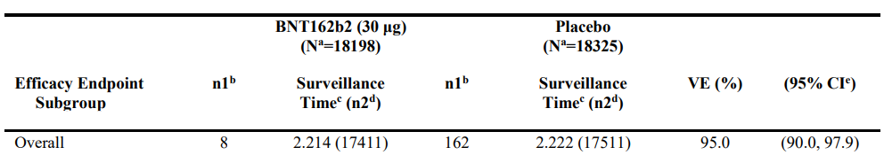

*Views and opinions expressed are solely my own.*

## Background

With COVID-19 vaccines now being widely available in the U.S., I've seen various interpretations of vaccine efficacy rates. As one example, [the paper](https://www.nejm.org/doi/full/10.1056/nejmoa2034577) disseminating the study on the efficacy of BioNTech and Pfizer's vaccine BNT162b2 states in its results section:

> BNT162b2 was 95% effective in preventing Covid-19

The intent of this post is to clarify the interpretations of such numbers.

## Calculation of the Point Estimate

The 95% figure is explained in the following sentence in the linked study:

> Vaccine efficacy was estimated by 100×(1−IRR), where IRR is the calculated ratio of confirmed cases of Covid-19 illness per 1000 person-years of follow-up in the active vaccine group to the corresponding illness rate in the placebo group.

These data can be found in Table S4 in the [Supplementary Appendix](https://www.nejm.org/doi/suppl/10.1056/NEJMoa2034577/suppl_file/nejmoa2034577_appendix.pdf) of the study. We refer to the top row of this table for this 95% figure:



From the [CDC's website](https://www.cdc.gov/csels/dsepd/ss1978/lesson3/section6.html),^[In case this link dies, it is Lesson 3 of *Principles of Epidemiology in Public Health Practice*, Third Edition (2011 edition).] VE, or vaccine efficacy, may be calculated by the formula 

\begin{align*}
\text{VE} &= 1 - \text{Risk Ratio} \\
&= 1 - \dfrac{\text{% who have a confirmed case of COVID-19, of the vaccinated group}}{\text{% who have a confirmed case of COVID-19, of the placebo group}}\text{.}
\end{align*}
These percentages may be calculated using the n1 and the n2 numbers. Thus,
\begin{align*}
\text{VE} = 1 - \dfrac{8/17411}{162/17511}
\end{align*}
which in R, calculates to 

```{r}
1-(8/17411)/(162/17511)
```

matching the 95% vaccine efficacy rate.

## Interpretation of the Efficacy Rate

One can see from the above that what 95% efficacy refers to is **not** that 5% of people in the study who obtain the BioNTech/Pfizer vaccine were infected with COVID-19, a common misinterpretation I've observed. 

To correct this interpretation, we first convert the vaccine efficacy to the corresponding risk ratio

```{r}
(8/17411)/(162/17511)
```

which is approximately 5%. The risk ratio is a ratio of proportions, with the units being in terms of the proportion of placebo-group participants who are infected with COVID, because this percentage is in the denominator. Thus, a 95% vaccine efficacy rate may be interpreted as follows:

> For every 1% of subjects who were infected with COVID-19 in the placebo group, 0.05% of subjects were infected with COVID-19 in the vaccinated group.

We obtained the 0.05% by virtue of the fact that 0.05 is 5% of 1. 

This result may be explained more generally as follows: suppose the vaccine efficacy is given by $V$ as a decimal number (i.e., the percentage divided by 100). Then the vaccine efficacy may be interpreted as follows:

> For every 1% of subjects who were infected with COVID-19 in the placebo group, $(1-V)$% of subjects were infected with COVID-19 in the vaccinated group.

## Conclusion

In the case of BioNTech and Pfizer's vaccine, 95% efficacy means that 

> For every 1% of subjects who were infected with COVID-19 in the placebo group, 0.05% of subjects were infected with COVID-19 in the vaccinated group.

where 0.05 was obtained from that $1 - 0.95 = 0.05$. This procedure can be easily extended to other vaccine efficacy rates.

## A Quick Note: Negative Vaccine Efficacy

Vaccine efficacy is bounded above by 1, but it is possible for vaccine efficacy to be negative. In this case, negative vaccine efficacy would occur when the proportion who have a confirmed case of COVID-19 of the vaccinated group exceeds that of the placebo group. The interpretation given above of the efficacy rate would still apply. However, since $V$ is negative, $1-V$ would exceed $1$.
