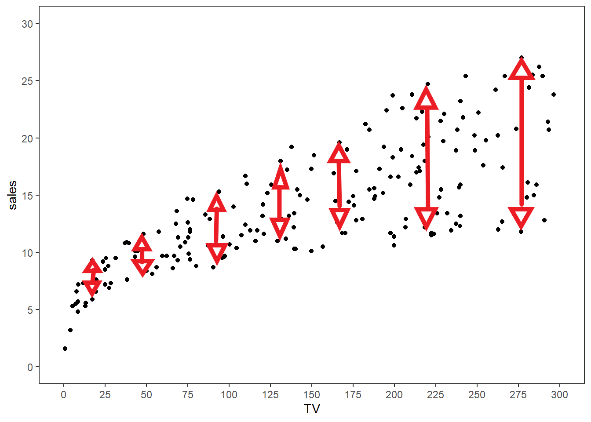

*Views and opinions expressed are solely my own.*

## Introduction

In this post, we will be building from the [linear regression theory post](/post/2021-07-17-lin-reg-1/everything-simple-lin-reg) and applying these concepts to a practical problem. 

My interest in writing this post is in outlining the complexities of doing a statistical analysis that are often omitted from textbooks, especially for a procedure that may appear to be as simple as fitting a line through points (linear regression). Statistics and machine learning textbooks often give the appearance that statistical choices may be based on a sequence of binary "this-is-true" or "this-is-not-true" decisions.

## Simulating the Setting

As mentioned in the previous post, we assume

$$Y_i = \beta_0 + \beta_1X_i + \epsilon_i = \text{intercept } + \text{slope }\cdot X_i + \unicode{x201C}\text{noise/error}\unicode{x201D}$$

with $\mathbb{E}[\epsilon_i \mid X_i] = 0$. Notice it follows immediately by [double expectation](https://en.wikipedia.org/wiki/Law_of_total_expectation) that $\mathbb{E}[\epsilon_i] = 0$. Here is an example of such data. For convenience, we assume that the $\epsilon_i$ are normally distributed with mean $0$ and variance $1$ in our simulation.

```{r message=FALSE, fig.height=6, fig.width=8}
library(ggplot2)

set.seed(45)

# generate a data frame of n x-y pairs based on
# the linearity + noise assumption
generate_df <- function(n, beta_0, beta_1, 
                        error_function, ...) {
  # Generate random x values between 0 and 20
  x <- runif(n = n, min = 0, max = 20)
  
  # Compute y_i
  y <- beta_0 + beta_1 * x + error_function(n = n, ...)
  
  # Create data frame
  return(data.frame(x = x, y = y))
}

# Set beta_0 to 0.5, beta_1 to 1
beta_0 <- 0.5
beta_1 <- 1

df <- generate_df(n = 200, 
                  beta_0 = beta_0, 
                  beta_1 = beta_1,
                  error_function = rnorm,
                  mean = 0, 
                  sd = 1)

# Define function for the true process, without the error term
f <- function(x, beta_0, beta_1) {
  return(beta_0 + beta_1 * x)
}

# Plot the graph
ggplot(df, aes(x = x, y = y)) + 
  geom_point() + # dots
  # the true process without the noise
  stat_function(fun = f, 
                args = list(beta_0 = beta_0, beta_1 = beta_1),
                color = "forestgreen",
                size = 2) +
  # black-and-white theme
  theme_bw() + 
  # blank panel grid
  theme(panel.grid = element_blank())
```

What the visualization is portraying above is that the true $Y_i$ values are a linear equation (in green) plus some "noise" whose mean is $0$.

## Application to Actual Data

We work with the `Advertising.csv` file from the second edition of *An Introduction to Statistical Learning*:

```{r }
df <- read.csv("https://www.statlearning.com/s/Advertising.csv",
               row.names = 1) # row 1 contains the row labels

head(df) # show first six rows
```
These data consist of $n = 200$ observations with $p = 4$ columns:

* `sales` in thousands of units for a particular product, as well as
* `TV`, `radio`, and `newspaper` advertising budgets in thousands of dollars.

Suppose we treat $Y_i$ as `sales` and $X_i$ as `TV`. Let's plot these data and see how they look:

```{r}
# Plot the graph
ggplot(df, aes(x = TV, y = sales)) + 
  geom_point() + # dots
  # black-and-white theme
  theme_bw() + 
  # blank panel grid
  theme(panel.grid = element_blank()) + 
  # x-scale: from 0 to 300, ticks every 25
  scale_x_continuous(limits = c(0, 300),
                     breaks = seq(0, 300, 25)) + 
  # y-scale: from 0 to 30, ticks every 5
  scale_y_continuous(limits = c(0, 30),
                     breaks = seq(0, 30, 5))
```

For simple linear regression, we would then assume that for each observation $i = 1, \dots, 200$ that the following relationship holds for some intercept $\beta_0$, slope term $\beta_1$, and noise term $\epsilon_i$ (with $\mathbb{E}[\epsilon_i \mid \text{TV}_i] = 0$) for each observation:
\begin{equation*}
\text{Sales}_i = \beta_0 + \beta_1 \cdot \text{TV}_i + \epsilon_i\text{.}
\end{equation*}

### Is this assumption true?

The reality is that, **unless we are in control of how the data are generated and know that the data may be specified by the process above**, we **cannot** guarantee that the 
\begin{equation*}
\text{Sales}_i = \beta_0 + \beta_1 \cdot \text{TV}_i + \epsilon_i
\end{equation*}
assumption is true. That is, given a bunch of `TV` values, unless we know for a fact that `Sales` were based on the form given above (like in our simulation we did earlier in this post), we cannot guarantee this assumption holds.

So the question of "is this assumption true?" turns into

### Is this assumption good enough?

This question is a much more difficult question to answer than the prior one, and is **often ignored**.

Two things I **do not** suggest for answering this question, though, include:

* Hypothesis testing for distributional fit or finding evidence of the coefficient $\beta_1$ being not equal to $0$ (such as through a $t$-test): such procedures encourage binary, "strict-cutoff"-type thinking which may give misleading results. Additionally, such hypothesis tests assume that the $\text{Sales}_i = \beta_0 + \beta_1 \cdot \text{TV}_i + \epsilon_i$ assumption is true to begin with.
* Relying solely on graphical procedures to test these assumptions: there are many arbitrary decisions that go into making a graph that could influence how you view the data (e.g., the axes bounds, ticks, etc.).

**The question of interest matters a lot than many textbooks suggest.** If someone poses to me a question similar to "how does TV advertising budget influence sales?" I would be inclined to assume the model $\text{Sales}_i = \beta_0 + \beta_1 \cdot \text{TV}_i + \epsilon_i$ just to get a "good-enough" result to start with, and if necessary, I can make it more complex from there. **In such cases, one prioritizes intepretability over precision.** 

Questions that are more detailed than "how does TV advertising budget influence sales?" - particularly if there is a sales prediction involved given a TV budget - may require more sophisticated tools than linear regression, such as [local regression](https://en.wikipedia.org/wiki/Local_regression), with some [cross validation](https://en.wikipedia.org/wiki/Cross-validation_(statistics)) thrown in. However, as one increases the level of sophistication of statistical tools, there is usually more of a problem of intepretability to general audiences. Back when I taught introductory data science, I referred to this phenomena as the **explainability vs. complexity tradeoff**.^[Artificial Intelligence is trying to address this issue through [explainable AI](https://en.wikipedia.org/wiki/Explainable_artificial_intelligence), but I am a skeptic about the long-term implications of this movement being successful.]

For the purposes of this post, we will assume that the model $\text{Sales}_i = \beta_0 + \beta_1 \cdot \text{TV}_i + \epsilon_i$ holds with $\mathbb{E}[\epsilon_i \mid \text{TV}_i] = 0$.

### Executing the regression procedure, and interpretation

If we assume $\text{Sales}_i = \beta_0 + \beta_1 \cdot \text{TV}_i + \epsilon_i$ holds with $\mathbb{E}[\epsilon_i \mid \text{TV}_i] = 0$, by the Gauss-Markov theorem, the least-squares estimators of $\beta_0$ and $\beta_1$ are their corresponding "best" estimators. In R, these may be calculated using the `lm` (linear model) function:

```{r}
# execute the least-squares procedure
model <- lm(sales ~ TV, data = df)

# return summary stats
summary(model)
```
The least squares estimators of $\beta_0$ and $\beta_1$ are $\hat{\beta}_0 = 7.032594$ and $\hat{\beta}_1 = 0.047537$ respectively. These may be interpreted as follows:

* A product with zero (thousands of) dollars of TV advertising budget sells roughly 7,033 ($1000 \cdot \hat{\beta}_0$) units of the product. This interpretation is based on the value of $\beta_0$, and recalling that both $\text{TV}_i$ and $\text{Sales}_i$ are measured in thousands.
* Adding one thousand dollars to the TV advertising budget for a product is associated with a \$47.54 ($1000 \cdot \hat{\beta}_1$) increase in sales.

**It is important to note that these interpretations rely on all of the following assumptions holding**: 

* $\text{Sales}_i = \beta_0 + \beta_1 \cdot \text{TV}_i + \epsilon_i$, and 
* $\mathbb{E}[\epsilon_i \mid \text{TV}_i] = 0$.

The first assumption above is especially important, in that no other variables other than $\text{TV}_i$ are included in the determination of $\text{Sales}_i$.

## Some other mathematical concerns

As mentioned in the prior [linear regression theory post](/post/2021-07-17-lin-reg-1/everything-simple-lin-reg), if we wish to calculate the variance of the least-squares estimators of $\beta_0$ and $\beta_1$, we must also assume that $\text{Var}[\text{Sales}_i \mid \text{TV}_i] = \sigma^2$. This condition is also known as **homoskedasticity**. In simple terms, homoskedasticity assumes that the variability of the $\text{Sales}_i$ is constant regardless of the value of $\text{TV}_i$ we have. When this condition does not hold, the model is said to exhibit **heteroskedasticity**, which is given emphasis in econometrics more often than statistics.^[See the [Wikipedia page on heteroskedasticity](https://en.wikipedia.org/wiki/Heteroscedasticity) for more information.] I haven't had much of a chance to dive into this world, but may cover this material in a future post.

From a naive visual inspection, one should observe that the $\text{Sales}_i$ values seem to be more spread out as the $\text{TV}_i$ values increase, which would suggest that we have heteroskedasticity. The variability of $\text{Sales}_i$ values seems to increase as $\text{TV}_i$ increases, roughly approximated by the red lines and arrows below.

{width=80% height=10%}

If we desire, we could assume the model $\text{Sales}_i = \beta_0 + \beta_1 \cdot \text{TV}_i + \epsilon_i$ holds with the variance of $\epsilon_i$ being proportional to $X_i$; i.e., $\text{Var}[\epsilon_i \mid \text{TV}_i] = \sigma^2 \cdot \text{TV}_i$. This is a more complicated version of simple linear regression than we've discussed so far, known as the [Aitken Model or Generalized Least Squares](https://en.wikipedia.org/wiki/Generalized_least_squares). I may write a post on this topic in the future.

## Conclusion

I hope this posts illustrates how complex a simple procedure such as univariate linear regression is, with regard to the thought process that has to go into validating assumptions and making tradeoffs between complexity and intepretability. Statistical education needs to make such thought processes more explicit.

## References

James, G., Witten, D., Hastie, T., &amp; Tibshirani, R. (2021). *An Introduction to Statistical Learning* (2nd ed.). New York, NY: Springer Science+Business Media. 
