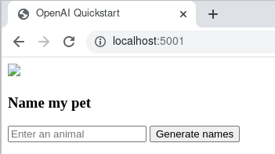
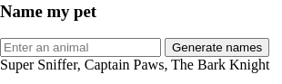

*Views and opinions expressed are solely my own.*

## Introduction

The [quickstart page](https://platform.openai.com/docs/quickstart) on the OpenAI website covers how to set up a connection to the ChatGPT API using Python. However, it does not explain how to replicate this same workflow using Docker, which would be useful for reproducibility purposes. We explain how to perform this same workflow using Docker.

## Setting up access to the ChatGPT API

The website for setting up accessing to the ChatGPT API (https://platform.openai.com/) is *not* the same as the website for accessing OpenAI's ChatGPT UI (https://chat.openai.com/). It is also worth noting that billing for the ChatGPT UI is *not* the same as the billing associated with the ChatGPT API. ChatGPT Plus, which currently uses GPT-4, currently costs $20/month. The ChatGPT API currently [costs](https://openai.com/pricing) $0.002/1000 tokens.

Using the ChatGPT API link given above, after logging in, click on the top right and go to "Manage Account." Click "Billing" on the left toolbar. You must have a payment method in your account in order to use the ChatGPT API. Once you have a payment method included, you may go to the OpenAI [quickstart tutorial](https://platform.openai.com/docs/quickstart) and you should be able to click through the examples without any issues.

## Setting up the Docker container

I am using WSL2 and Ubuntu with the Docker CLI. In brief, to set these up, you will need to enable [Hyper-V using PowerShell](https://learn.microsoft.com/en-us/virtualization/hyper-v-on-windows/quick-start/enable-hyper-v), enable [containers using PowerShell](https://stackoverflow.com/a/68854362/3625022), and enable [ virtualization](https://support.microsoft.com/en-us/windows/enable-virtualization-on-windows-11-pcs-c5578302-6e43-4b4b-a449-8ced115f58e1). Then WSL2 [can be installed](https://learn.microsoft.com/en-us/windows/wsl/install) and then one can follow the Docker [installation instructions](https://docs.docker.com/desktop/windows/wsl/). 

Continue to follow the [quickstart tutorial](https://platform.openai.com/docs/quickstart) until after the API key is created. You should have cloned OpenAI's Git repository, and included your secret API key in an `.env` file.

With thanks to guidance from [Turner-Trauring](https://pythonspeed.com/articles/activate-virtualenv-dockerfile/), we can use the following Dockerfile and add to the Git repository:

```
FROM python:3.11.3

ENV VIRTUAL_ENV=/opt/venv
ENV PIP_ROOT_USER_ACTION=ignore
ENV FLASK_ENV=development

RUN python3 -m venv $VIRTUAL_ENV
ENV PATH="$VIRTUAL_ENV/bin:$PATH"

COPY requirements.txt .
COPY app.py .
COPY templates ./templates
COPY .env .

RUN pip install --upgrade pip
RUN pip install -r requirements.txt

CMD ["flask", "run", "--host", "0.0.0.0"]
```

To avoid errors with `pip`, I changed the `numpy` line of `requirements.txt` to
```
numpy==1.22.0
```

## Docker command execution

**First**, be sure that the file `/etc/resolv.conf` has the correct DNS configuration for your purposes. See [this link](https://stackoverflow.com/a/62087459/3625022). Your correct DNS can be found by navigating to your Command Prompt, running `ipconfig -all` and looking for the value next to `Default Gateway`. The file `/etc/resolv.conf` is a read-only file, and if you use `vi` or `vim` to edit it, you will need to use `:w !sudo tee %` to edit the file after making the change (see [this link](https://superuser.com/a/785016)).

In WSL2, navigate to the directory in which the Git repository is located. Run the command

```
docker build -t chatgpt:1 .
```

This creates a Docker image based on the Dockerfile, tagging it with the name `chatgpt:1`. Pandas, in particular, will take a long time to install.

Then, one can execute the command

```
docker run -p 5001:5000 chatgpt:1
```

The following will appear: 

```
 * Serving Flask app 'app' (lazy loading)
 * Environment: development
 * Debug mode: on
 * Running on all addresses.
   WARNING: This is a development server. Do not use it in a production deployment.
 * Running on http://172.17.0.2:5000/ (Press CTRL+C to quit)
 * Restarting with stat
 * Debugger is active!
 * Debugger PIN: 336-956-833
 ```
 
 **In a new command prompt window**, open WSL2 again and if you don't have a web browser installed already, install one. (I use [Google Chrome in Ubuntu](https://askubuntu.com/questions/510056/how-to-install-google-chrome).) In your web browser, navigate to the address `localhost:5001`. This will yield the following window.

<p align="center">

</p>

I typed in the word "dog" before clicking the "Generate names" button.

<p align="center">

</p>

ChatGPT suggested the names "Super Sniffer," "Captain Paws," and "The Bark Knight." You can then move on to the remainder of the quickstart page provided by OpenAI.

## Conclusion

We demonstrated how to replicate OpenAI's quickstart tutorial using Docker and Python within WSL2. This tutorial can be easily extended to individual needs.