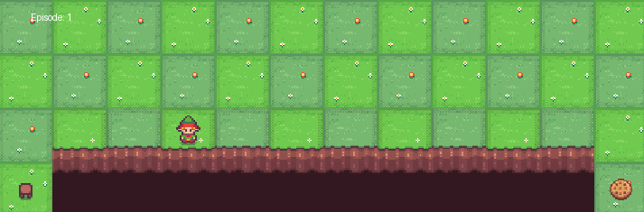
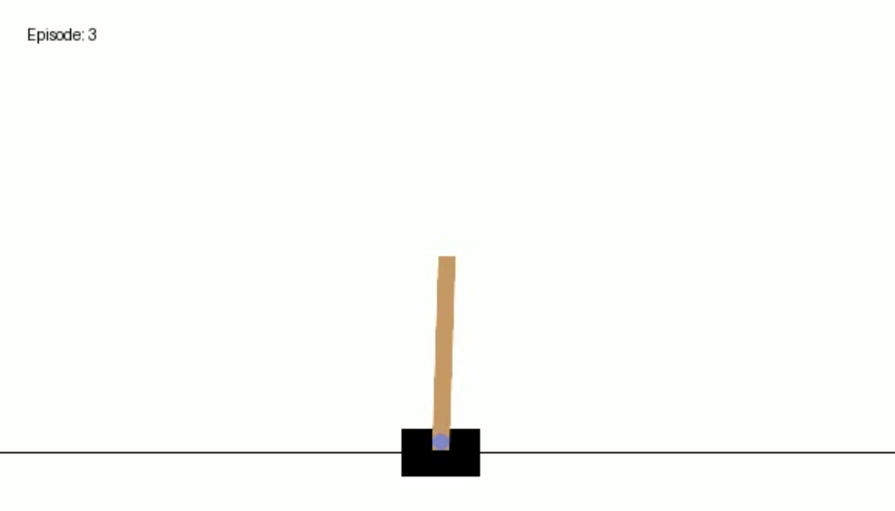

<html>

</html>

*Views and opinions expressed are solely my own.*

## Introduction

In my talk in [Data Tech 2024](https://minneanalytics.org/datatech-2024/) on June 7, 2024, I will be taking the audience from a background in undergraduate probability through a journey through what I have learned about reinforcement learning over the last school year, through an intro to deep reinforcement learning (DRL). The code for my presentation is [here](https://github.com/millerchangym/data-tech-2024-deepRL).

## $Q$-learning

We will start off the presentation by using finance (?!) to motivate the basics of reinforcement learning, making our way through introductory reinforcement learning. The first algorithm we will cover is $Q$-learning. 

I will discuss the `gymnasium` (https://gymnasium.farama.org/) package briefly, and will show how to solve the [Cliff Walking environment](https://gymnasium.farama.org/environments/toy_text/cliff_walking/) using $Q$-learning.

The Cliff Walking environment, visualized above, works as follows:

* The agent starts at the bottom left and aims to reach the bottom right without falling into the "cliff" between the two spaces.
* Rewards are $-1$ for each space the agent travels, and $-100$ if the agent falls into the cliff.
* The agent must move up, down, left, or right on every turn. No other actions are permissible. Note the highest possible reward is $-13$.

One core principle of machine learning is **though a model may perform well in training, it does not necessarily mean it will perform well in testing.** My first implementation of this was unsuccessful in testing, though in training it seemed to do fine.

<iframe width="560" height="315" src="https://www.youtube.com/embed/1lSOBP8W-lo?si=Ew_VtZRUTWds_q-E" title="YouTube video player" frameborder="0" allow="accelerometer; autoplay; clipboard-write; encrypted-media; gyroscope; picture-in-picture; web-share" referrerpolicy="strict-origin-when-cross-origin" allowfullscreen></iframe>

The above model I trained, when tested, led the agent to go up until it was stuck at the top-left corner, and hit the top wall at an infinite loop. After doing some hyperparameter tuning, I performed the training below:

<iframe width="560" height="315" src="https://www.youtube.com/embed/L0hLNSii3c0?si=18oxMrfmuRuJfQk3" title="YouTube video player" frameborder="0" allow="accelerometer; autoplay; clipboard-write; encrypted-media; gyroscope; picture-in-picture; web-share" referrerpolicy="strict-origin-when-cross-origin" allowfullscreen></iframe>

As you can see below, the agent in testing more or less executes the most optimal path to solve the environment:

<iframe width="560" height="315" src="https://www.youtube.com/embed/vhl1KZK7uYY?si=5_zzb61pF2eeTtbq" title="YouTube video player" frameborder="0" allow="accelerometer; autoplay; clipboard-write; encrypted-media; gyroscope; picture-in-picture; web-share" referrerpolicy="strict-origin-when-cross-origin" allowfullscreen></iframe>

## Deep-$Q$ network (DQN)

We will also illustrate a first algorithm of deep reinforcement learning, known as deep-$Q$ networks (DQN). We will use the `torch` package with the [Cart Pole environment](https://gymnasium.farama.org/environments/classic_control/cart_pole/) to illustrate DQN. As described in the website:

> A pole is attached by an un-actuated joint to a cart, which moves along a frictionless track. The pendulum is placed upright on the cart and the goal is to balance the pole by applying forces in the left and right direction on the cart.

Two actions are possible: we either push the cart to the left or the right. There are 4 continuous variables that are observed: the cart position and velocity, and the pole's angle and angular velocity. Termination occurs either when the center of the cart is out of bounds, or the pole has an angle greater than $\pm 12$ degrees. A reward of 1 is alloted for each step taken.

I did not spend the time to really tune this, but show the results of my naive tuning here. Here's how the agent performed in training:

<iframe width="560" height="315" src="https://www.youtube.com/embed/bU-FQZnrlDA?si=t9aBRq3jQBUAOVGK" title="YouTube video player" frameborder="0" allow="accelerometer; autoplay; clipboard-write; encrypted-media; gyroscope; picture-in-picture; web-share" referrerpolicy="strict-origin-when-cross-origin" allowfullscreen></iframe>

and here's how it performed in testing:

<iframe width="560" height="315" src="https://www.youtube.com/embed/S-o7WFidLE8?si=T1Ywp07Okun-tL7R" title="YouTube video player" frameborder="0" allow="accelerometer; autoplay; clipboard-write; encrypted-media; gyroscope; picture-in-picture; web-share" referrerpolicy="strict-origin-when-cross-origin" allowfullscreen></iframe>

I look forward to seeing you at Data Tech 2024!

## Suggested readings and citations

Albrecht, S. V., Christianos, F., Schäfer, L. (2024). Multi-Agent Reinforcement Learning: Foundations and Modern Approaches. MIT Press. https://www.marl-book.com/

Littman, M. L. (1996). Algorithms for sequential decision-making. Ph.D. Dissertation. Brown University, USA.

Mnih V. et al. (2013). Playing Atari with Deep Reinforcement Learning. https://arxiv.org/abs/1312.5602

Morales, M. (2020). Grokking deep reinforcement learning. Manning Publications Co.

Sutton, R. and Barto, A. (2020). Reinforcement Learning: An Introduction. MIT Press. http://incompleteideas.net/book/the-book-2nd.html

Watkins, C. J. C. H. (1989). Learning from Delayed Rewards. PhD thesis, University of
Cambridge.